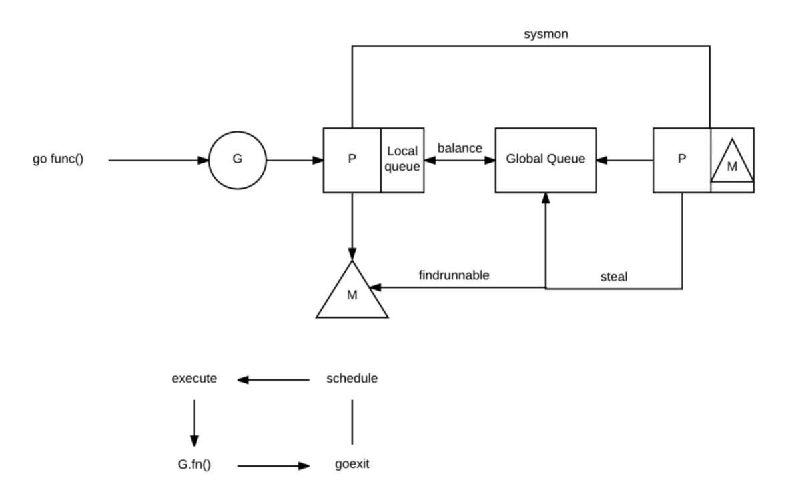
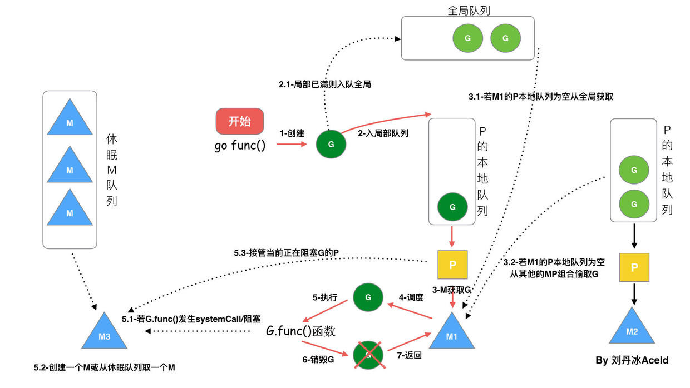

# GMP模型

## **简介（by chatgpt）**

Go语言（Golang）的GMP模型是用来处理并发的核心概念。其中，GMP分别代表：

- **G**（Goroutine）：G表示一个轻量级的线程。它是Go语言中并发执行的基本单位。与传统线程相比，Goroutine的创建和销毁开销更小，它们在用户空间中进行管理，可以成千上万地同时运行。

- **M**（Machine）：M表示物理线程（或操作系统线程）。它们是与操作系统紧密绑定的实体，负责执行Goroutine。Go运行时会将一个或多个Goroutine调度到一个M上执行。

- **P**（Processor）：P表示一个逻辑处理器。每个P有自己的Goroutine队列，Go运行时通过调度管理Goroutine的执行。P的数量通常与机器的CPU核心数相对应，P控制着Goroutine的运行。

### GMP模型的工作机制

1. **Goroutine的创建和调度**：
   - 当你在Go中使用`go`关键字创建Goroutine时，Go运行时会将其添加到一个P的Goroutine队列中。
   - 每个P可以从其队列中取出Goroutine并使用其所在的M来执行。

2. **调度**：
   - Go运行时使用一种称为工作窃取的算法来调度Goroutine。当一个M空闲时，它可以从其他P的队列中窃取Goroutine来执行，以保持CPU的高效利用。

3. **并发执行**：
   - 通过这种GMP结构，Go可以有效地在多个处理器上并发执行Goroutine，使得程序能够充分利用多核CPU。

### 优势

- **高效性**：Goroutine的创建和切换比传统线程要轻量得多，大大减少了资源开销。
- **易用性**：Go语言提供了简单的语法来创建Goroutine，降低了并发编程的复杂性。
- **自动调度**：开发者不需要手动管理线程的生命周期，Go运行时负责调度Goroutine，简化了并发编程的模型。

总之，GMP模型使得Go语言在处理并发任务时具备了灵活性和高效性，适合构建高性能的网络服务和并发应用程序。

## 调度流程

1. 当我们执行 `go func()` 时，实际上就是创建一个全新的 Goroutine，我们称它为 G。
2. 新创建的 G 会被放入 P 的本地队列（Local Queue）或全局队列（Global Queue）中，准备下一步的动作。需要注意的一点，这里的 P 指的是创建 G 的 P。
3. 唤醒或创建 M 以便执行 G。
4. 不断地进行事件循环
5. 寻找在可用状态下的 G 进行执行任务
6. 清除后，重新进入事件循环

在描述中有提到全局和本地这两类队列，其实在功能上来讲都是用于存放正在等待运行的 G，但是不同点在于，本地队列有数量限制，不允许超过 256 个。

并且在新建 G 时，会优先选择 P 的本地队列，如果本地队列满了，则将 P 的本地队列的一半的 G 移动到全局队列。

这可以理解为调度资源的共享和再平衡。

注意：

- 为什么要有P，如果只用M（系统线程），如果存在系统阻塞调用，阻塞了 M，又不够用的情况下，M 会不断增加。M 不断增加的话，如果本地队列挂载在 M 上，那就意味着本地队列也会随之增加。这显然是不合理的，因为本地队列的管理会变得复杂，且 Work Stealing 性能会大幅度下降。M 被系统调用阻塞后，我们是期望把他既有未执行的任务分配给其他M继续运行的，而不是一阻塞就导致全部停止。

- P的数量可以使用环境变量`GOMAXPROCS`设置

- 队列是和P关联的

### Working Steal窃取工作

为了解决可能的工作分配不平衡问题，避免M浪费，使用了窃取机制。

如果一个P完成了自己的工作，同时全局队列也没有工作可以执行，它就会随机从其他还有工作的P的队列中窃取一半工作到自己的队列中。

## 参考

[Go 群友提问：Goroutine 数量控制在多少合适，会影响 GC 和调度？](https://mp.weixin.qq.com/s?__biz=MzUxMDI4MDc1NA%3D%3D&chksm=f9041a4fce7393597151804174e0d9ac1889f1fff7ac46b1c64de4b4c477e9f1b596eda21d3e&idx=1&mid=2247487250&scene=21&sn=3004324a9d2ba99233c4af48843dba64#wechat_redirect)

[GMP模型 调度机制](https://go.cyub.vip/gmp/gmp-model/)

